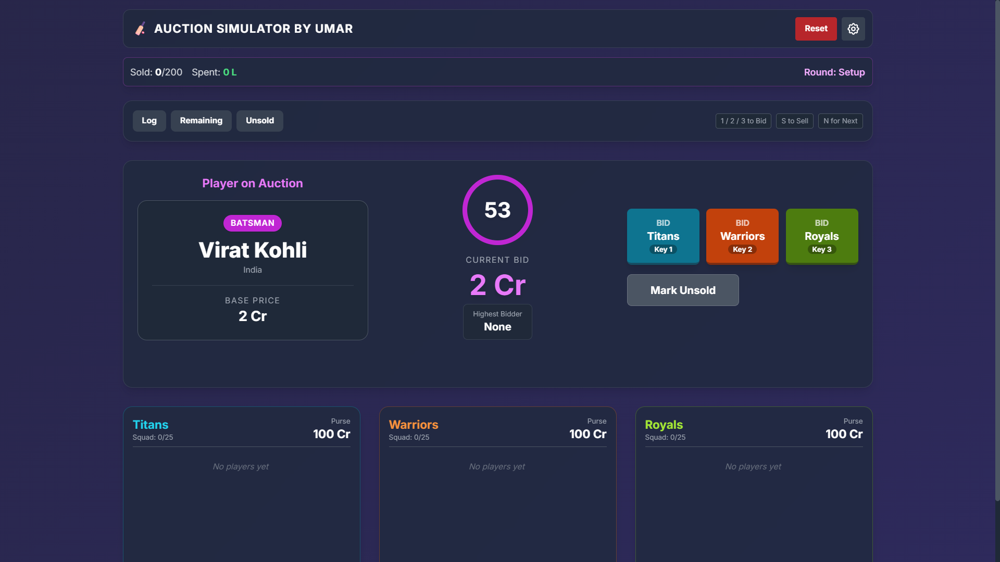
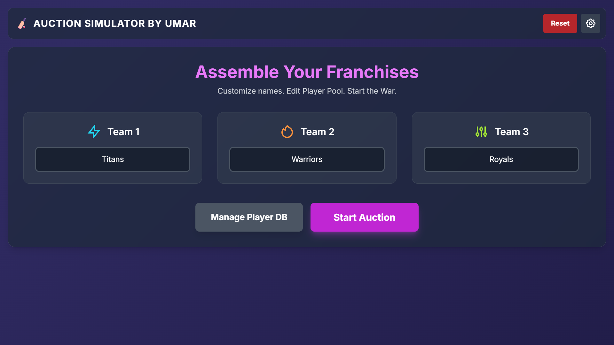
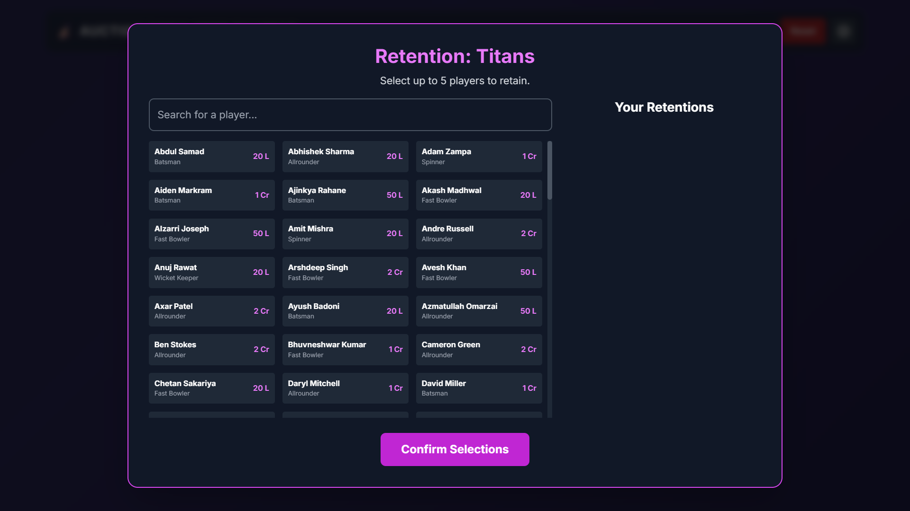
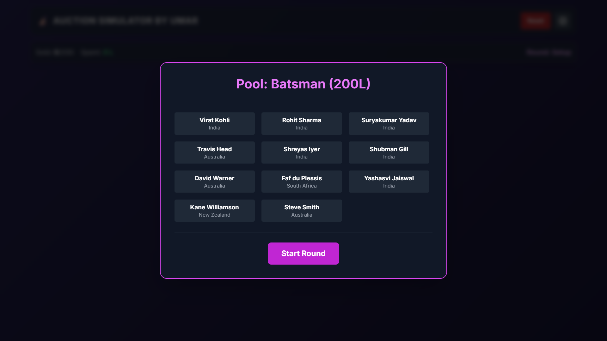
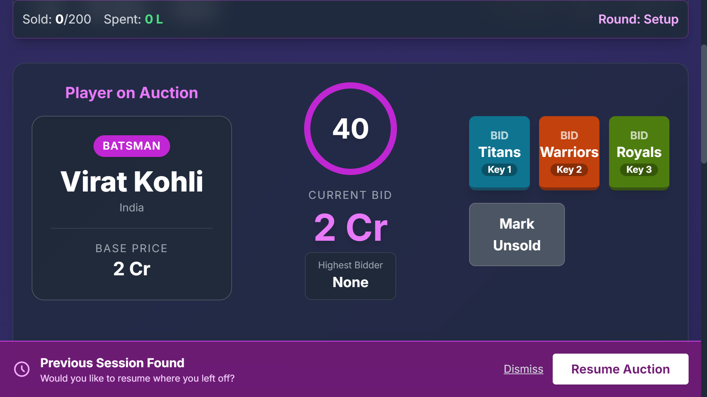
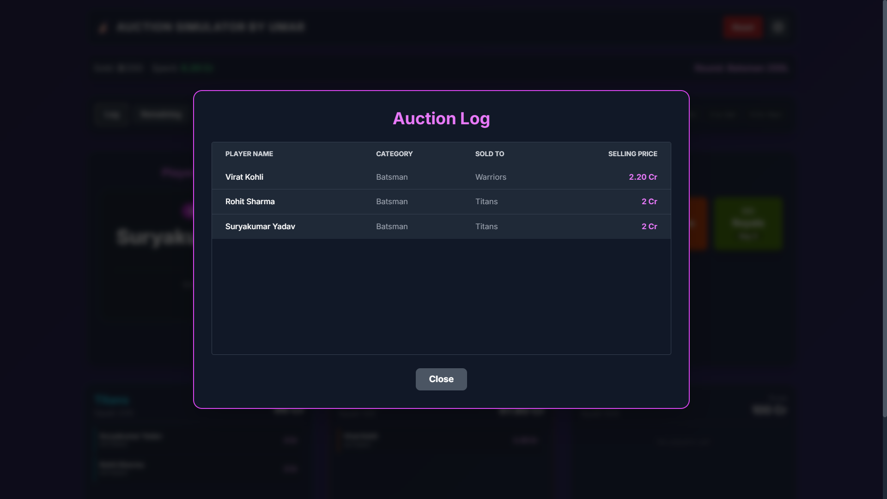
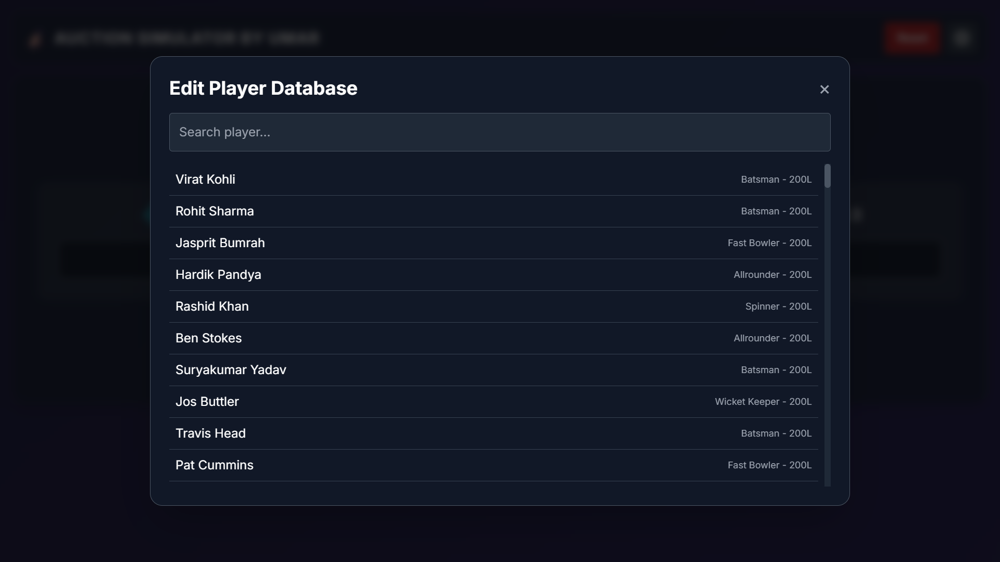

🏏 Cricket Auction Simulator

Experience the High-Stakes Thrill of a T20 Auction

Build your dream squad. Outbid your rivals. Manage your purse.

Report Bug • Request Feature

📖 About The Project

Cricket Auction Simulator is a feature-packed, single-page web application designed to recreate the intensity of a professional cricket player auction. Built entirely with Vanilla JavaScript and styled with Tailwind CSS, it offers a seamless, lag-free experience right in your browser.

Whether you are hosting a fun event with friends or just testing your management skills against the computer, this simulator handles all the calculations, timers, and logic for you.

📸 Screenshots

Main Dashboard

 

Setup & Teams

 

Game Phases

 

Auction Action

 

Management

✨ Key Features

🎮 Gameplay

Real-time Bidding: Intense 60-second timer per player with dynamic bid increments.

Three-Team System: Manage bids for 3 distinct franchises simultaneously.

Retention Phase: Select up to 5 core players before the auction starts (with automatic purse deductions).

Unsold Re-Auction: A second chance to buy players who went unsold in the first round.

⚙️ Customization & Controls

Settings Panel: Configure Starting Purse, Timer Duration, and Toggle Game Phases.

Player Database Editor: Edit player names, base prices, and categories directly within the app.

Keyboard Shortcuts:

1, 2, 3 : Bid for Team 1, 2, or 3.

N : Next Player.

S : Sell Player.

📊 Dashboard & Analytics

Sticky Stats Bar: Always-on display of Total Spent, Players Sold, and Current Round.

Detailed Logs: View a history of every sold player and price.

Squad Views: Visual breakdown of every team's current squad and remaining budget.

💾 Persistence

Auto-Save: Never lose your progress. The app saves to localStorage automatically.

Resume Session: One-click resume if you accidentally close the tab.

🚀 Getting Started

This project requires no installation, no servers, and no build steps.

Option 1: Direct Download

Download the index.html file.

Double-click it to open in Chrome, Firefox, Edge, or Safari.

Option 2: Clone Repository

git clone [https://github.com/your-username/cricket-auction-simulator.git](https://github.com/your-username/cricket-auction-simulator.git)
cd cricket-auction-simulator
# Open index.html in your browser

🔊 Adding Sound Effects (Optional)

For the best immersive experience, create a folder named sounds next to your index.html and add these files:

bid.wav

sold.wav

unsold.wav

tension.wav

crowd-loop.mp3

(The app works perfectly without sounds, but they add to the atmosphere!)

🔮 Roadmap

[ ] Mock Draft Mode (Snake draft style)

[ ] Complex Squad Rules (Max overseas players, Min uncapped players)

[ ] Expanded Database (Import/Export CSV support)

[ ] Team Branding (Upload custom logos)

[ ] Animations (Confetti on big signings, gavel animations)

🛠️ Built With

🤝 Contributing

Contributions are what make the open-source community such an amazing place to learn, inspire, and create. Any contributions you make are greatly appreciated.

Fork the Project

Create a Feature Branch (git checkout -b feature/AmazingFeature)

Commit your Changes (git commit -m 'Add some AmazingFeature')

Push to the Branch (git push origin feature/AmazingFeature)

Open a Pull Request

📝 License

Distributed under the MIT License. See LICENSE for more information.

Created with ❤️ by <a href="https://github.com/umarmahtab">Umar Mahtab</a>

