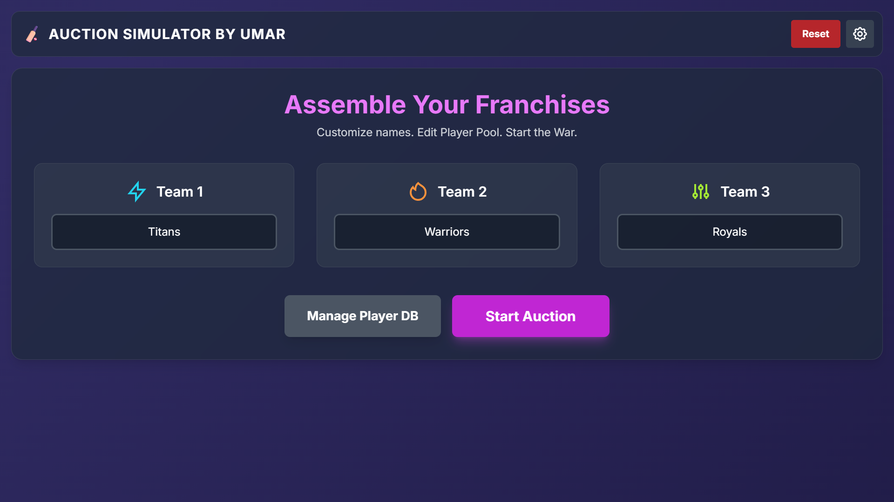
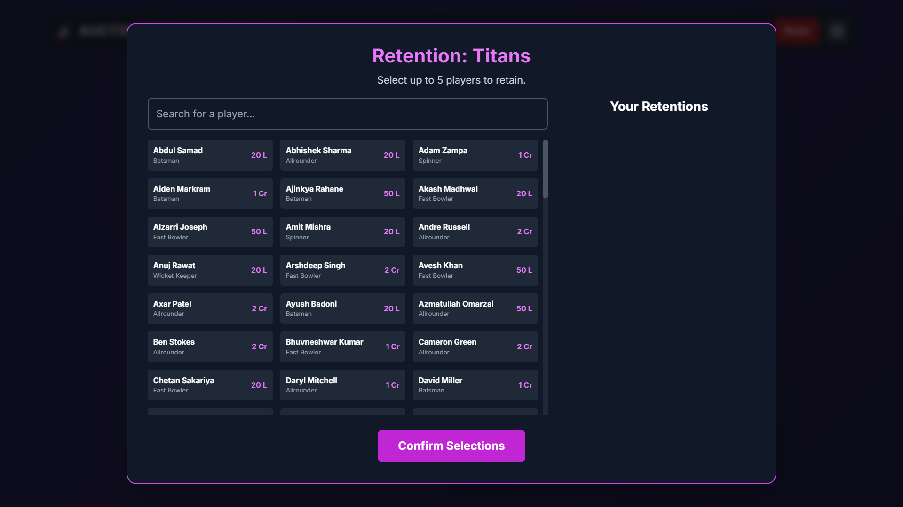
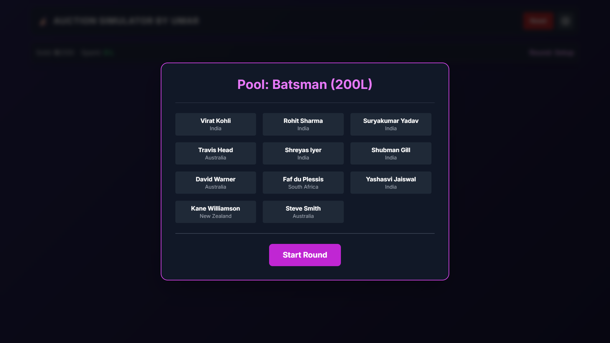
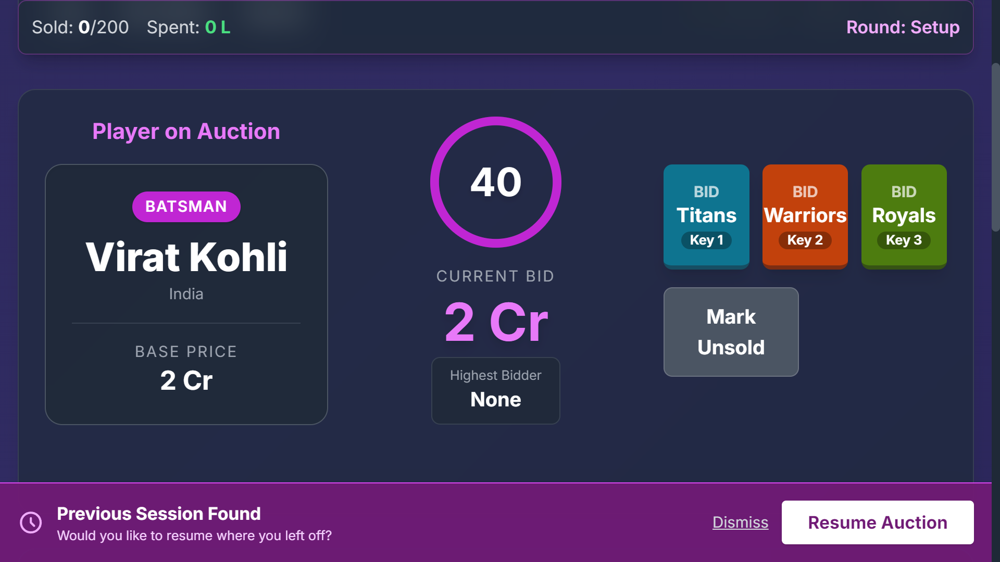
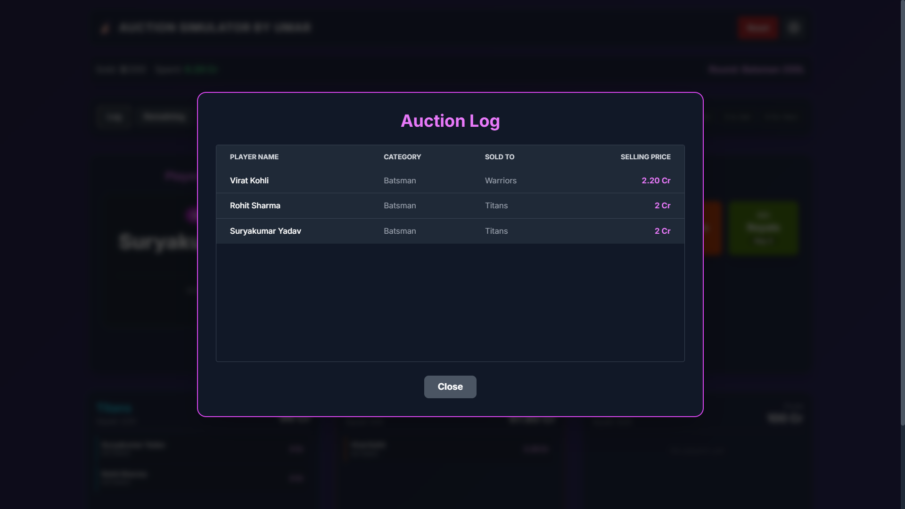

# 🏏 Cricket Auction Simulator

> A modern browser-based IPL-style cricket auction simulator featuring real-time bidding, player retention, team management, auction analytics, and customizable auction settings.

<p align="center">

[](YOUR_VERCEL_LINK)
[](YOUR_GITHUB_LINK)

</p>

---

> [!IMPORTANT]
> **This repository contains the latest version of Cricket Auction Simulator.**
>
> Looking for the previous version?
>
> **Legacy Repository (V1):**  
> https://github.com/umarmahtab/YOUR-OLD-REPOSITORY
>
> This version features a redesigned interface, improved auction flow, better performance, enhanced team management, new customization options, and several quality-of-life improvements over the original release.

---

## 🌐 Live Demo

👉 **Play Here:**  
**https://your-project.vercel.app**

---

# 📖 About

Cricket Auction Simulator recreates the excitement of a professional T20 player auction directly in your browser.

Create your own franchises, strategically bid for players, manage your auction purse, retain star players, monitor auction statistics, and build your dream squad through a realistic auction experience.

Built using **HTML5**, **CSS3**, **JavaScript**, and **Tailwind CSS**, the simulator runs entirely inside your browser without requiring any installation.

---

# 🚀 Version 2 (Currently in Development)

The next major update is currently under active development and testing.

### Planned Features

- 🌐 Online Multiplayer Auctions
- 🎨 Multiple UI Themes
- 📄 Export Auction as PDF
- 📊 Export Auction as Excel
- 📁 Save & Load Auctions using JSON
- 🔄 Cloud Save Support
- 📱 Improved Mobile Experience
- 🎭 Better Animations
- 🔊 Enhanced Sound Effects
- ⚡ Performance Optimizations

---

# 📸 Screenshots

<table>
<tr>
<td></td>
<td></td>
</tr>

<tr>
<td></td>
<td></td>
</tr>

<tr>
<td></td>
<td></td>
</tr>

<tr>
<td></td>
<td></td>
</tr>
</table>

---

# ✨ Features

## 🏏 Auction Gameplay

- Real-time player bidding
- Live auction countdown timer
- Three-franchise auction system
- Automatic bid increments
- Intelligent purse management
- Player retention phase
- Unsold player re-auction
- Live auction activity logs
- Auto winner detection
- Keyboard shortcuts

---

## 👥 Team Management

- Team squad overview
- Remaining purse tracking
- Sold player history
- Category-wise player management
- Live team statistics
- Complete auction summary

---

## ⚙️ Auction Settings

- Adjustable auction timer
- Custom starting purse
- Toggle retention phase
- Built-in player database editor
- Flexible auction configuration

---

## 💾 Data Management

- Automatic Local Storage save
- Resume previous auction
- Persistent settings
- Planned JSON Import & Export (V2)

---

# ⌨️ Keyboard Shortcuts

| Key | Action |
|------|---------|
| **1** | Bid for Team 1 |
| **2** | Bid for Team 2 |
| **3** | Bid for Team 3 |
| **N** | Next Player |
| **S** | Sell Current Player |

---

# 🛠 Built With

- HTML5
- CSS3
- JavaScript (ES6)
- Tailwind CSS
- Local Storage API

---

# 🚀 Getting Started

Clone the repository

```bash
git clone https://github.com/umarmahtab/cricket-auction-simulator.git
```

Navigate into the project

```bash
cd cricket-auction-simulator
```

Open

```text
index.html
```

in your preferred browser.

No installation or build tools are required.

---

# 🔊 Optional Sound Effects

Create a folder named

```text
sounds/
```

and add the following files:

```text
bid.wav
sold.wav
unsold.wav
tension.wav
crowd-loop.mp3
```

The simulator works perfectly without these files, but they significantly improve the auction atmosphere.

---

# 🗺 Roadmap

- ✅ Real-Time Auction Engine
- ✅ Player Retention System
- ✅ Auction Logs
- ✅ Local Save System
- ✅ Player Database Editor
- ⏳ Online Multiplayer
- ⏳ PDF Export
- ⏳ Excel Export
- ⏳ JSON Save & Load
- ⏳ Multiple Themes
- ⏳ Team Logos
- ⏳ Cloud Save
- ⏳ Mobile Optimizations

---

# 🤝 Contributing

Contributions, ideas, feature requests, and bug reports are always welcome.

Feel free to fork the repository and submit a Pull Request.

---

# 📄 Disclaimer

This project is an independent fan-made cricket auction simulator created for educational and entertainment purposes.

It is **not affiliated with, endorsed by, or associated with the IPL, BCCI, or any official cricket organization**. Team names, player names, logos (if added), and auction concepts are used solely to provide a realistic simulation experience.

---

# 👨‍💻 Author

**Umar Mahtab**

GitHub: https://github.com/umarmahtab

---

⭐ **If you enjoyed this project, consider giving it a Star!**
